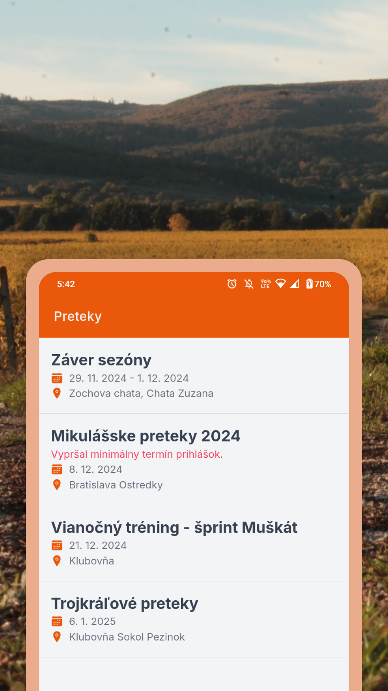

# Orientačný beh

Aplikácia na zjednodušenie prihlasovania na preteky zo stránky:
https://members.eob.cz/

## Gallery

</img> </img> </img>

## Inštalácia

```sh
git clone https://github.com/sokolpezinok/orientacny-beh
cd orientacny-beh
npm install
```

## Development

**Starts the Vite development server.**

```sh
npm run dev
```

**Builds the production version using Vite.**

```sh
npm run build
```

**Previews the production build locally.**

```sh
npm run preview
```

**Builds the project and runs it on an Android device/emulator.**

```sh
npm run build:android
```

**Builds the project for bundle size visualization.**

```sh
npm run build:visualize
```

**Syncs Capacitor and opens the Android project in Android Studio.**

```sh
npm run open:android
```

## Build

- Android

```sh
npm run build
npm run open:android
```

In Android Studio select `Build`->`Generate Signed Bundle / APK`.

## Extensions & Environment

We use [VS Code](https://code.visualstudio.com/) with following extensions:

- [Prettier - Code formatter](https://marketplace.visualstudio.com/items?itemName=esbenp.prettier-vscode)
- [Tailwind CSS IntelliSense](https://marketplace.visualstudio.com/items?itemName=bradlc.vscode-tailwindcss)
- [Code Spell Checker](https://marketplace.visualstudio.com/items?itemName=streetsidesoftware.code-spell-checker)
  - [Slovak - Code Spell Checker](https://marketplace.visualstudio.com/items?itemName=streetsidesoftware.code-spell-checker-slovak)
  - [Czech - Code Spell Checker](https://marketplace.visualstudio.com/items?itemName=streetsidesoftware.code-spell-checker-czech)

## Licencia

This project is licensed under the MIT License - see the [LICENSE](./LICENSE) file for details.
