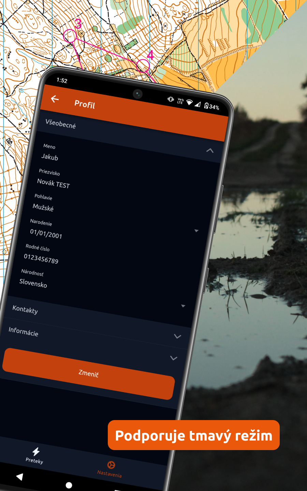

# Orientačný beh

Aplikácia na zjednodušenia prihlasovania na preteky zo stránky https://members.eob.cz/.

## Gallery

</img> </img> </img> </img>

## Inštalácia

```sh
git clone https://github.com/sokolpezinok/orientacny-beh && cd orientacny-beh

npm install
npm run build
```

## Debug

- Web

```sh
npm run dev
```

Otvor `localhost:3000` vo svojom prehliadači. Zmeny v kóde sa automaticky prejavia na webe.

- Android

```sh
npm run build
```

Pripoj svoj android do počítača, povoľ `allow debugging` a spusť nasledovný príkaz. [Viac informácií](https://stackoverflow.com/a/71426608/14900791)

```sh
npm run android
```

## Build

- Android

```sh
npm run build
npm run open-android
```

V Android Studio zvoľ `Build`->`Generate Signed Bundle / APK`.

## Vývoj

Odporúčame používať [VS Code](https://code.visualstudio.com/) s nasledovnými rozšíreniami:

- [Prettier - Code formatter](https://marketplace.visualstudio.com/items?itemName=esbenp.prettier-vscode)
- [Tailwind CSS IntelliSense](https://marketplace.visualstudio.com/items?itemName=bradlc.vscode-tailwindcss)
- [Code Spell Checker](https://marketplace.visualstudio.com/items?itemName=streetsidesoftware.code-spell-checker)
  - [Slovak - Code Spell Checker](https://marketplace.visualstudio.com/items?itemName=streetsidesoftware.code-spell-checker-slovak)
  - [Czech - Code Spell Checker](https://marketplace.visualstudio.com/items?itemName=streetsidesoftware.code-spell-checker-czech)

## Licencia

Aplikácia `Orientačný beh` je pod licenciou **MIT License**.
