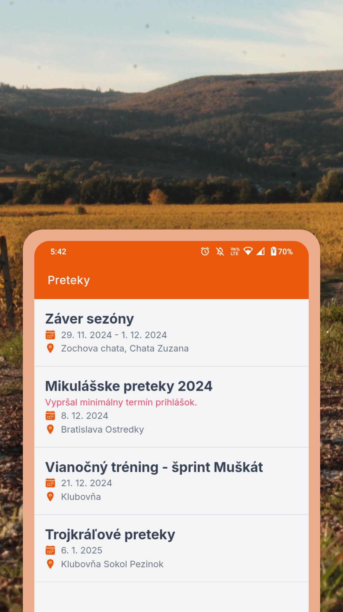

# Orientačný beh

Aplikácia na zjednodušenie prihlasovania na preteky zo stránky:
https://members.eob.cz/

## Gallery

</img> </img> </img>

## Installation

```sh
git clone https://github.com/sokolpezinok/orientacny-beh
cd orientacny-beh
pnpm i
```

## Build

No need, we have CI/CD now!

```sh
# run tests
pnpm tsc --noEmit
pnpm run lint
pnpm run jest

# set env variables
export ANDROID_VERSION_CODE=123
export VITE_APP_VERSION="1.2.3"

# build the app
pnpm run android:build-release

# sign AAB and APK with apksigner and jarsigner
```

## PNPM Commands

**Starts the Vite development server.**

```sh
pnpm run dev
```

**Builds the production version using Vite.**

```sh
pnpm run build
```

**Previews the production build locally.**

```sh
pnpm run preview
```

**Builds the project and outputs in `dist/`**

```sh
pnpm run build
```

**Builds APK and AAB files in `dist/`**

```sh
pnpm run android:build-release
```

**Syncs Capacitor and opens the Android project in Android Studio.**

```sh
pnpm run android:open
```

**Cleans android cache**

```sh
pnpm run android:clean
```

## Tests & Linting

**Runs tests**

```sh
pnpm run test
```

**Runs eslint**

```sh
pnpm run lint
```

## Extensions & Environment

We use [VS Code](https://code.visualstudio.com/) with following extensions:

- [Prettier - Code formatter](https://marketplace.visualstudio.com/items?itemName=esbenp.prettier-vscode)
- [Tailwind CSS IntelliSense](https://marketplace.visualstudio.com/items?itemName=bradlc.vscode-tailwindcss)
- [Code Spell Checker](https://marketplace.visualstudio.com/items?itemName=streetsidesoftware.code-spell-checker)
  - [Slovak - Code Spell Checker](https://marketplace.visualstudio.com/items?itemName=streetsidesoftware.code-spell-checker-slovak)
  - [Czech - Code Spell Checker](https://marketplace.visualstudio.com/items?itemName=streetsidesoftware.code-spell-checker-czech)

## Licencia

This project is licensed under the MIT License - see the [LICENSE](./LICENSE) file for details.
